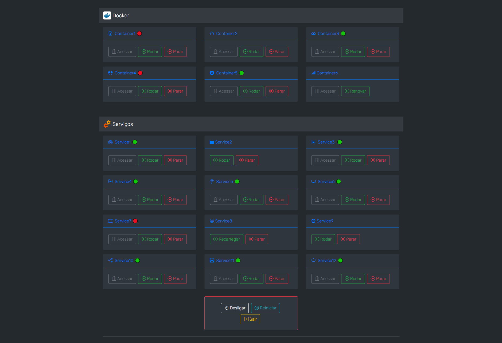

# Docker-and-Services-Manager
---

Uma interface Web para gerenciar serviços do sistema e containers do Docker, facilmente personalizável.

## Info:
- A senha padrão é "default". É recomendável alterá-la, através do setup.php.
- O setup.php apresenta instruções de configuração do sistema, para que todas as funções trabalhem corretamente.

## Créditos:
Base do código: [Raspberry Pi Dashboard](https://github.com/femto-code/Raspberry-Pi-Dashboard/)
